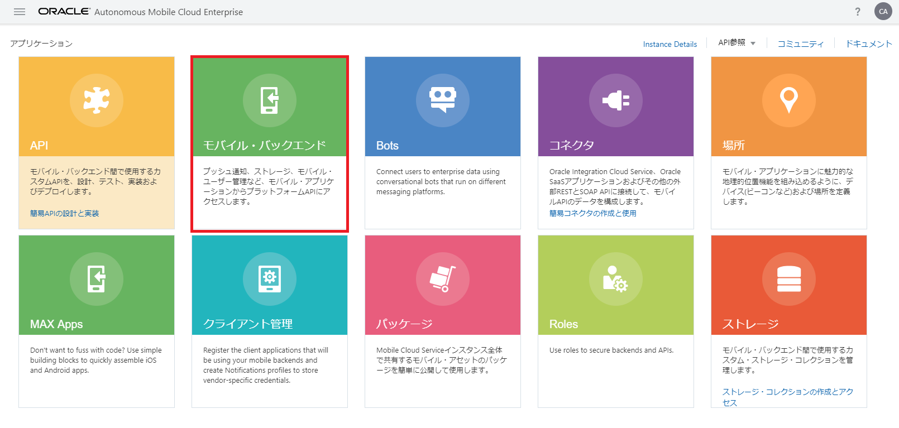
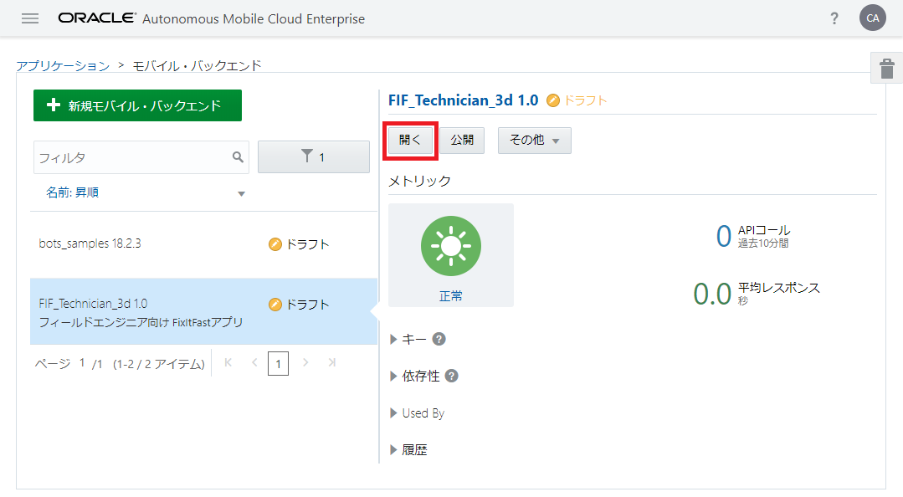
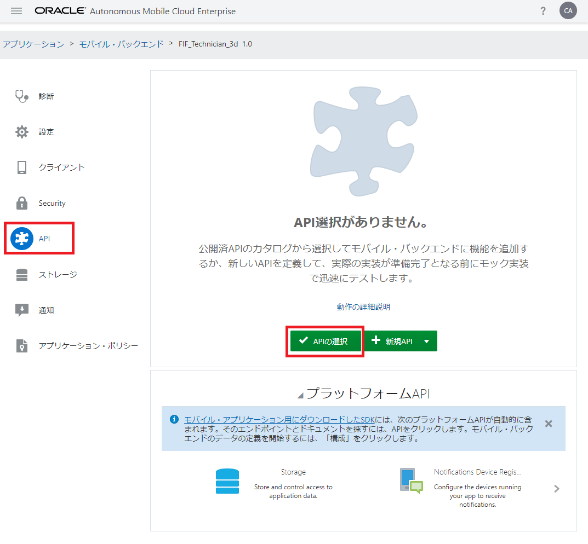

## モバイル・バックエンドとカスタムAPIの関連づけ

実際にモバイル・アプリからAMCe上で実行されているカスタムAPIをコールするためには、モバイル・バックエンドとカスタムAPIを関連づける必要があります。
手順は次のとおりです。

**Step-1**
サービス・コンソールにログインし、ハンバーガー・アイコンをクリックして画面左のメニューから「アプリケーション」を選択します。「アプリケーション」ページが表示されたら、「モバイル・バックエンド」をクリックします。

 
<strong>図：「アプリケーション」ページで「モバイル・バックエンド」をクリック</strong>

**Step-2**
画面左のリストから、「FIF_Technician_xx（このハンズオンの『[モバイル・バックエンドの作成](2.backend-1.md)』で作成したモバイル・バックエンド）を選択し、「開く」ボタンをクリックします。

> **備考：**
> モバイル・バックエンドの名前につけた「xx」の文字列で検索すると、リストされるモバイル・バックエンドがフィルタリングされて便利です。

 
<strong>図：モバイル・バックエンドを選択して「開く」ボタンをクリック</strong>

**Step-3**
モバイル・バックエンドの「API」ページを開き、「APIの選択」ボタンをクリックします。

 
<strong>図：モバイル・バックエンドの「API」ページで「APIの選択」ボタンをクリック</strong>

**Step-4**
「APIカタログ」が表示されます。
「FIF_IncidentReport_xx」（このハンズオンの『[RAMLドキュメントを使用したAPIの定義とテスト](2.backend-2.md)』で登録したカスタムAPI）のボックスの右下に表示されている「＋（APIの選択）」ボタンをクリックします。

 
<strong>図：APIカタログで「FIF_IncidentRepor_xx」を選択</strong>

**Step-5**
画面右側の「選択済みAPI」に「FIF_IncidentRepor_xx」が表示されます。

 
<strong>図：APIカタログでAPIを選択した状態</strong>

画面左上のリンク「< FIF_Technician_xx 1.0」をクリックします。
